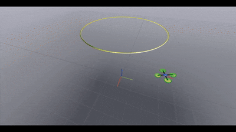

# QuasiStatic-FTC

<div style="text-align: center;">
  
</div>

For details, see the project page:  
[https://gradslab.github.io/quasistatic-ftc/](https://gradslab.github.io/quasistatic-ftc/)


# Quadrotor Failure Simulation (Drake + Meshcat)

A physics-based quadrotor rigid-body simulation built with **Drake**.
The system simulates a UAV tracking a spatial curve, then introduces a **rotor failure at `t = 20s`**, visualized live in a browser via **Meshcat** and logged to CSV.

The controller is implemented in `QSF_combined` and the vehicle is modeled as a floating rigid body using quaternion dynamics.

---

## What this project does

The program:

1. Builds a 6-DoF rigid body in Drake
2. Attaches a quadrotor visualization
3. Tracks a circular 3D trajectory
4. At **20 seconds** → rotor 1 fails (visualized live)
5. Logs:

   * position
   * quaternion
   * Euler angles
   * velocity
   * angular velocity
   * control force
   * torque
   * thrust
6. Saves all data to:

```
Drake_data.csv
```

You also get a live 3D animation in your browser.

---

## Demo Visualization

When running, open:

```
http://localhost:7004
```

You will see:

* yellow curve (desired path)
* quadrotor
* world frame axes
* rotor color change when failure occurs

---

## Project Structure

```
.
├── main.py
├── qsf_controller.py
├── draw_curve.py
├── UAV_visual.py
├── Drake_data.csv (generated)
└── README.md
```

---

## Requirements

This project **WILL NOT RUN** with a normal `pip install`.
You must install **Drake** correctly.

Supported OS:

* Ubuntu 22.04/24.04 (recommended)
* macOS (works)
* Windows (NOT recommended — use WSL2 Ubuntu)

Python version:

```
Python 3.10 or 3.11 (important)
```

---

## 1) Install Drake (the correct way)

Create a clean environment first.

### Ubuntu / WSL2

Install system dependencies:

```bash
sudo apt update
sudo apt install python3.10 python3.10-venv python3-pip -y
```

Create virtual environment:

```bash
python3.10 -m venv drake-env
source drake-env/bin/activate
```

Upgrade pip:

```bash
pip install --upgrade pip
```

Install Drake:

```bash
pip install drake
```

(Yes — Drake is now officially pip-installable. Do **not** use conda for this project.)

Verify:

```bash
python -c "import pydrake; print('Drake installed')"
```

---

## 2) Install Python Dependencies

```bash
pip install numpy scipy matplotlib meshcat
```

---

## 3) Clone the GitLab repository

```bash
git clone https://gitlab.com/a5akhtar/quasistatic-ftc.git
cd quasistatic-ftc
```

---

## 4) Run the simulation

Activate environment:

```bash
source drake-env/bin/activate
```

Run:

```bash
python main.py
```

You should see:

```
Meshcat: http://localhost:7004
Keep-alive running; press Ctrl+C to quit.
```

Open a browser and go to:

```
http://localhost:7004
```

---

## What you will observe

| Time    | Behavior                       |
| ------- | ------------------------------ |
| 0–20 s  | quadrotor tracks circular path |
| 20 s    | rotor 1 fails (color switches) |
| 20–40 s | controller compensates         |

---

## Output Data

After the simulation finishes:

```
Drake_data.csv
```

Columns:

```
t, p1, p2, p3,
qw, qx, qy, qz,
theta, phi, psi,
vx, vy, vz,
omega1, omega2, omega3,
fx, fy, fz,
thrust,
tau1, tau2, tau3
```

This file can be loaded directly in:

* MATLAB
* Python
* Julia

Example:

```python
import pandas as pd
data = pd.read_csv("Drake_data.csv")
```

---

## Important Notes

### The program never exits

This is intentional.

At the end:

```python
while True:
    time.sleep(1)
```

This keeps Meshcat alive so you can replay the animation.

Stop with:

```
Ctrl + C
```

---

## Troubleshooting

### Meshcat page is blank

Check firewall or port conflict:

Change in `main.py`:

```python
port = 7004
```

to any free port between:

```
7000 – 9000
```

---

### `ModuleNotFoundError: pydrake`

You are **not inside the virtual environment**.

Run:

```bash
source drake-env/bin/activate
```

---

### Simulation extremely slow

You are likely running:

* Windows native Python
* or inside VSCode debugger

Run from a terminal instead.

---

### Nothing moves

Make sure you clicked **play** in the Meshcat UI timeline (top-left controls).

---

## Controller

The controller used:

```
QSF_combined
```

It outputs:

* world force
* body torque
* thrust

and switches behavior after rotor failure.

---

## Authors
A. Akhtar and M. Al-Lawati 
GitLab: [https://gitlab.com/a5akhtar](https://gitlab.com/a5akhtar)

---

## License

MIT License


